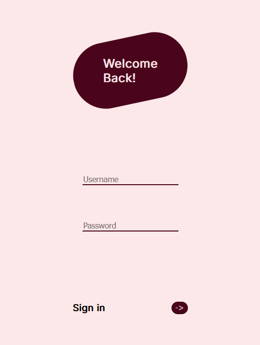
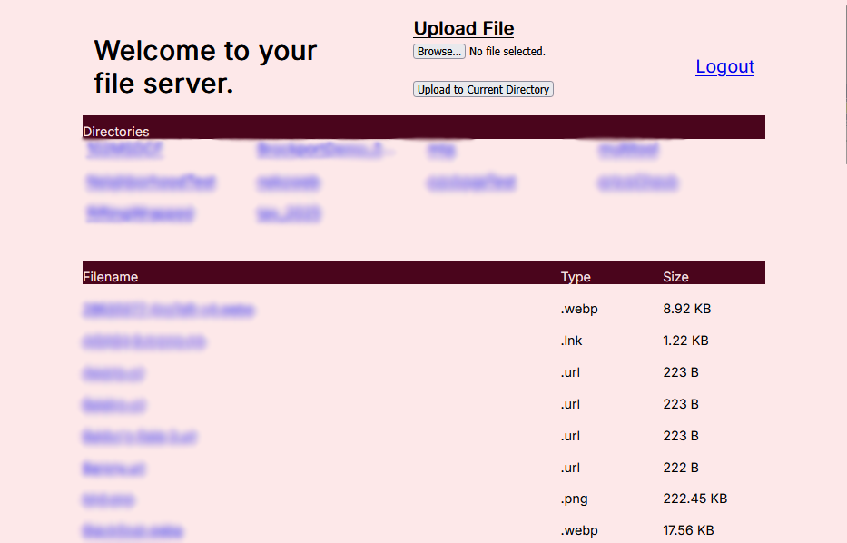

<div align="center">

<h1> Simple Fileshare </h1>

<p> A basic fileshare server to transfer files between different devices.
</p>



</div>


## Features 

- Browse your device directories and files in a browser 
- Self-signed SHA256 certificates using OpenSSL
- Upload and download files between devices
- Login/logout with simple authentication
- Access your server quickly via QR code
- Serve files over HTTPS with SSL


_Example UI of the main fileshare page_


>[!IMPORTANT]
>While the trafic over this fileshare server is encrypted and secured, this project is mainly for a proof of concept. For production applications, a more secure service like Flask is recommended. 


## Setup

1) Install project requirements
```
pip install -r requirements.txt
```

2) Create a `.env` file containing login information, as shown in [example.env](example.env)

3) Generate SSL certificates 
```
python generate_certificates.py
```

4) Start the fileshare server
```
python fileshare.py
```

5) Connect to the server. This can be done through the CLI-generated QR code, or by visiting the served URL.